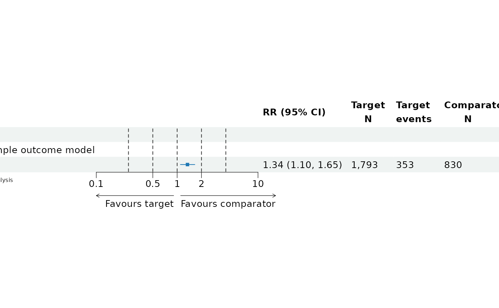

# Using Observational Health Data Sciences and Informatics (OHDSI) Report Generator

## Using the OhdsiReportGenerator Package

This package enables users to extract characterization, estimation and
prediction results from the OHDSI results (see [result
model](https://ohdsi.github.io/Strategus/results-schema/index.html))
generated via R packages such as `PatientLevelPrediction`,
`Characterization`, `CohortMethod` and `SelfControlledCaseSeries`.

### Example Result Database

This package provides users with an example OHDSI result database. This
can be accessed via
[`getExampleConnectionDetails()`](../reference/getExampleConnectionDetails.md)
and contains the results of running a demo analysis using the Eunomia R
package sample OMOP CDM data.

``` r
library(OhdsiReportGenerator)
# create a connection details object to 
connectionDetails <- getExampleConnectionDetails()

# create a connection handler to the results
library(ResultModelManager)
```

    ## Loading required package: R6

    ## Loading required package: DatabaseConnector

``` r
ConnectionHandler <- ResultModelManager::ConnectionHandler$new(connectionDetails)
```

    ## Connecting using SQLite driver

### Extracting Cohorts

The cohort details can be extracted using the function
`getCohortDefinitions` that requires the user to input the connection
handler, schema, table prefix used by CohortGenerator (default is
‘cg\_’) and target cohort ids to restrict to.

The example results are in a sqlite database and use the schema ‘main’.

``` r
cohorts <- getCohortDefinitions(
    connectionHandler = ConnectionHandler,
    schema = 'main',
    cgTablePrefix = 'cg_',
    targetIds = NULL
)

knitr::kable(
  x = cohorts %>% 
    dplyr::select(-"json", -"sqlCommand"), 
  caption = 'The data.frame extracted containing the cohort details minus the json and sqlCommand columns.'
  )
```

| cohortDefinitionId | cohortName                            | description | subsetParent | isSubset | subsetDefinitionId | isTemplatedCohort | subsetDefinitionJson | templateName | templateSql | templateJson |
|-------------------:|:--------------------------------------|------------:|-------------:|---------:|-------------------:|------------------:|:---------------------|-------------:|------------:|-------------:|
|                  1 | Celecoxib                             |          NA |            1 |        0 |                 NA |                 0 | NA                   |           NA |          NA |           NA |
|                  2 | Diclofenac                            |          NA |            2 |        0 |                 NA |                 0 | NA                   |           NA |          NA |           NA |
|                  3 | GI bleed                              |          NA |            3 |        0 |                 NA |                 0 | NA                   |           NA |          NA |           NA |
|                  4 | Acetaminophen                         |          NA |            4 |        0 |                 NA |                 0 | NA                   |           NA |          NA |           NA |
|                  5 | Amoxicillin                           |          NA |            5 |        0 |                 NA |                 0 | NA                   |           NA |          NA |           NA |
|                  6 | Aspirin                               |          NA |            6 |        0 |                 NA |                 0 | NA                   |           NA |          NA |           NA |
|                  7 | Clavulanate                           |          NA |            7 |        0 |                 NA |                 0 | NA                   |           NA |          NA |           NA |
|                  8 | Death                                 |          NA |            8 |        0 |                 NA |                 0 | NA                   |           NA |          NA |           NA |
|                  9 | Doxylamine                            |          NA |            9 |        0 |                 NA |                 0 | NA                   |           NA |          NA |           NA |
|                 10 | PenicillinV                           |          NA |           10 |        0 |                 NA |                 0 | NA                   |           NA |          NA |           NA |
|                 11 | ViralSinusitis                        |          NA |           11 |        0 |                 NA |                 0 | NA                   |           NA |          NA |           NA |
|               1001 | Celecoxib - age 18 to 64 Age 18 to 64 |          NA |            1 |        1 |                  1 |                 0 | {                    |              |             |              |

The data.frame extracted containing the cohort details minus the json
and sqlCommand columns.

“name”: “age 18 to 64”, “definitionId”: 1, “subsetOperators”: \[ {
“name”: “Age 18 to 64”, “subsetType”: “DemographicSubsetOperator”,
“ageMin”: 18, “ageMax”: 64 } \], “packageVersion”: “1.1.0”,
“identifierExpression”: “targetId \* 1000 + definitionId”,
“operatorNameConcatString”: “,”, “subsetCohortNameTemplate”:
“@baseCohortName - @subsetDefinitionName @operatorNames” } \| NA\| NA\|
NA\| \| 2001\|Diclofenac - age 18 to 64 Age 18 to 64 \| NA\| 2\| 1\| 1\|
0\|{ “name”: “age 18 to 64”, “definitionId”: 1, “subsetOperators”: \[ {
“name”: “Age 18 to 64”, “subsetType”: “DemographicSubsetOperator”,
“ageMin”: 18, “ageMax”: 64 } \], “packageVersion”: “1.1.0”,
“identifierExpression”: “targetId \* 1000 + definitionId”,
“operatorNameConcatString”: “,”, “subsetCohortNameTemplate”:
“@baseCohortName - @subsetDefinitionName @operatorNames” } \| NA\| NA\|
NA\| \| 1002\|Celecoxib - first event with 365 prior obs first event
with 365 prior obs \| NA\| 1\| 1\| 2\| 0\|{ “name”: “first event with
365 prior obs”, “definitionId”: 2, “subsetOperators”: \[ { “name”:
“first event with 365 prior obs”, “subsetType”: “LimitSubsetOperator”,
“priorTime”: 365, “followUpTime”: 0, “minimumCohortDuration”: 0,
“limitTo”: “firstEver” } \], “packageVersion”: “1.1.0”,
“identifierExpression”: “targetId \* 1000 + definitionId”,
“operatorNameConcatString”: “,”, “subsetCohortNameTemplate”:
“@baseCohortName - @subsetDefinitionName @operatorNames” } \| NA\| NA\|
NA\| \| 2002\|Diclofenac - first event with 365 prior obs first event
with 365 prior obs \| NA\| 2\| 1\| 2\| 0\|{ “name”: “first event with
365 prior obs”, “definitionId”: 2, “subsetOperators”: \[ { “name”:
“first event with 365 prior obs”, “subsetType”: “LimitSubsetOperator”,
“priorTime”: 365, “followUpTime”: 0, “minimumCohortDuration”: 0,
“limitTo”: “firstEver” } \], “packageVersion”: “1.1.0”,
“identifierExpression”: “targetId \* 1000 + definitionId”,
“operatorNameConcatString”: “,”, “subsetCohortNameTemplate”:
“@baseCohortName - @subsetDefinitionName @operatorNames” } \| NA\| NA\|
NA\| \| 1003\|Celecoxib - age 18 to 64 and first event with 365 prior
obs Age 18 to 64, first event with 365 prior obs \| NA\| 1\| 1\| 3\|
0\|{ “name”: “age 18 to 64 and first event with 365 prior obs”,
“definitionId”: 3, “subsetOperators”: \[ { “name”: “Age 18 to 64”,
“subsetType”: “DemographicSubsetOperator”, “ageMin”: 18, “ageMax”: 64 },
{ “name”: “first event with 365 prior obs”, “subsetType”:
“LimitSubsetOperator”, “priorTime”: 365, “followUpTime”: 0,
“minimumCohortDuration”: 0, “limitTo”: “firstEver” } \],
“packageVersion”: “1.1.0”, “identifierExpression”: “targetId \* 1000 +
definitionId”, “operatorNameConcatString”: “,”,
“subsetCohortNameTemplate”: “@baseCohortName - @subsetDefinitionName
@operatorNames” } \| NA\| NA\| NA\| \| 2003\|Diclofenac - age 18 to 64
and first event with 365 prior obs Age 18 to 64, first event with 365
prior obs \| NA\| 2\| 1\| 3\| 0\|{ “name”: “age 18 to 64 and first event
with 365 prior obs”, “definitionId”: 3, “subsetOperators”: \[ { “name”:
“Age 18 to 64”, “subsetType”: “DemographicSubsetOperator”, “ageMin”: 18,
“ageMax”: 64 }, { “name”: “first event with 365 prior obs”,
“subsetType”: “LimitSubsetOperator”, “priorTime”: 365, “followUpTime”:
0, “minimumCohortDuration”: 0, “limitTo”: “firstEver” } \],
“packageVersion”: “1.1.0”, “identifierExpression”: “targetId \* 1000 +
definitionId”, “operatorNameConcatString”: “,”,
“subsetCohortNameTemplate”: “@baseCohortName - @subsetDefinitionName
@operatorNames” } \| NA\| NA\| NA\|

You can process the cohorts definitions to extract the parent cohorts
and the children for each parent cohort.

``` r
if(nrow(cohorts) > 0){
processedCohorts <- processCohorts(cohorts)

knitr::kable(
  x = data.frame(
    parentId = processedCohorts$parents,
    parentName= names(processedCohorts$parents)
    ), 
  caption = 'The parent cohorts.'
  )

knitr::kable(
  x = processedCohorts$cohortList[[1]] %>% 
    dplyr::select(-"json", -"sqlCommand"),
  caption = 'The children/subset cohorts for the first parent cohort.'
  )
}
```

| cohortDefinitionId | cohortName                            | description | subsetParent | isSubset | subsetDefinitionId | isTemplatedCohort | subsetDefinitionJson | templateName | templateSql | templateJson |
|-------------------:|:--------------------------------------|------------:|-------------:|---------:|-------------------:|------------------:|:---------------------|-------------:|------------:|-------------:|
|                  1 | Celecoxib                             |          NA |            1 |        0 |                 NA |                 0 | NA                   |           NA |          NA |           NA |
|               1001 | Celecoxib - age 18 to 64 Age 18 to 64 |          NA |            1 |        1 |                  1 |                 0 | {                    |              |             |              |

The children/subset cohorts for the first parent cohort.

“name”: “age 18 to 64”, “definitionId”: 1, “subsetOperators”: \[ {
“name”: “Age 18 to 64”, “subsetType”: “DemographicSubsetOperator”,
“ageMin”: 18, “ageMax”: 64 } \], “packageVersion”: “1.1.0”,
“identifierExpression”: “targetId \* 1000 + definitionId”,
“operatorNameConcatString”: “,”, “subsetCohortNameTemplate”:
“@baseCohortName - @subsetDefinitionName @operatorNames” } \| NA\| NA\|
NA\| \| 1002\|Celecoxib - first event with 365 prior obs first event
with 365 prior obs \| NA\| 1\| 1\| 2\| 0\|{ “name”: “first event with
365 prior obs”, “definitionId”: 2, “subsetOperators”: \[ { “name”:
“first event with 365 prior obs”, “subsetType”: “LimitSubsetOperator”,
“priorTime”: 365, “followUpTime”: 0, “minimumCohortDuration”: 0,
“limitTo”: “firstEver” } \], “packageVersion”: “1.1.0”,
“identifierExpression”: “targetId \* 1000 + definitionId”,
“operatorNameConcatString”: “,”, “subsetCohortNameTemplate”:
“@baseCohortName - @subsetDefinitionName @operatorNames” } \| NA\| NA\|
NA\| \| 1003\|Celecoxib - age 18 to 64 and first event with 365 prior
obs Age 18 to 64, first event with 365 prior obs \| NA\| 1\| 1\| 3\|
0\|{ “name”: “age 18 to 64 and first event with 365 prior obs”,
“definitionId”: 3, “subsetOperators”: \[ { “name”: “Age 18 to 64”,
“subsetType”: “DemographicSubsetOperator”, “ageMin”: 18, “ageMax”: 64 },
{ “name”: “first event with 365 prior obs”, “subsetType”:
“LimitSubsetOperator”, “priorTime”: 365, “followUpTime”: 0,
“minimumCohortDuration”: 0, “limitTo”: “firstEver” } \],
“packageVersion”: “1.1.0”, “identifierExpression”: “targetId \* 1000 +
definitionId”, “operatorNameConcatString”: “,”,
“subsetCohortNameTemplate”: “@baseCohortName - @subsetDefinitionName
@operatorNames” } \| NA\| NA\| NA\|

For example, if you created a cohort corresponding to all patients
exposed to drug A with an id of 1 and then created ‘children’ subset
cohorts corresponding to patients exposed to drug A for indication X
with an id 1001 and patients exposed to drug A aged 60+ with a cohort id
1002, then `getCohortDefinition()` would extract all three of these
cohorts and [`processCohorts()`](../reference/processCohorts.md) would
identify cohort 1 as the parent and cohorts 1,1001,1002 as the
children/subset of cohort 1.

You can also extract the subset logic for a subset id:

``` r
subsets <- getCohortSubsetDefinitions(
    connectionHandler = ConnectionHandler,
    schema = 'main',
    cgTablePrefix = 'cg_'
)

knitr::kable(
  x = subsets, 
  caption = 'The subset cohort logic used in the analysis.'
  )
```

| subsetDefinitionId | json |
|-------------------:|:-----|
|                  1 | {    |

The subset cohort logic used in the analysis.

“name”: “age 18 to 64”, “definitionId”: 1, “subsetOperators”: \[ {
“name”: “Age 18 to 64”, “subsetType”: “DemographicSubsetOperator”,
“ageMin”: 18, “ageMax”: 64 } \], “packageVersion”: “1.1.0”,
“identifierExpression”: “targetId \* 1000 + definitionId”,
“operatorNameConcatString”: “,”, “subsetCohortNameTemplate”:
“@baseCohortName - @subsetDefinitionName @operatorNames” } \| \| 2\|{
“name”: “first event with 365 prior obs”, “definitionId”: 2,
“subsetOperators”: \[ { “name”: “first event with 365 prior obs”,
“subsetType”: “LimitSubsetOperator”, “priorTime”: 365, “followUpTime”:
0, “minimumCohortDuration”: 0, “limitTo”: “firstEver” } \],
“packageVersion”: “1.1.0”, “identifierExpression”: “targetId \* 1000 +
definitionId”, “operatorNameConcatString”: “,”,
“subsetCohortNameTemplate”: “@baseCohortName - @subsetDefinitionName
@operatorNames” } \| \| 3\|{ “name”: “age 18 to 64 and first event with
365 prior obs”, “definitionId”: 3, “subsetOperators”: \[ { “name”: “Age
18 to 64”, “subsetType”: “DemographicSubsetOperator”, “ageMin”: 18,
“ageMax”: 64 }, { “name”: “first event with 365 prior obs”,
“subsetType”: “LimitSubsetOperator”, “priorTime”: 365, “followUpTime”:
0, “minimumCohortDuration”: 0, “limitTo”: “firstEver” } \],
“packageVersion”: “1.1.0”, “identifierExpression”: “targetId \* 1000 +
definitionId”, “operatorNameConcatString”: “,”,
“subsetCohortNameTemplate”: “@baseCohortName - @subsetDefinitionName
@operatorNames” } \|

### Extracting Characterization Results

The characterization analysis contains time to event results,
dechallenge-rechallenge, risk factor and cohort incidence results.

The time-to-event results tell you how often a outcome occurs relative
to some target cohort index date on a 1-day, 30-day and 365-day scale.

``` r
tte <- getTimeToEvent(
    connectionHandler = ConnectionHandler,
    schema = 'main'
)

knitr::kable(
  x = tte %>% dplyr::filter(.data$timeScale == 'per 365-day'), 
  caption = 'Example time-to-event results for the 365-day scale.'
  )
```

| databaseName | databaseId | targetName                             | targetId | outcomeName | outcomeId | outcomeType | targetOutcomeType         | timeToEvent | numEvents | timeScale   |
|:-------------|:-----------|:---------------------------------------|---------:|:------------|----------:|:------------|:--------------------------|------------:|----------:|:------------|
| Synthea      | 388020256  | Celecoxib                              |        1 | GI bleed    |         3 | first       | After last target end     |         365 |       327 | per 365-day |
| Synthea      | 388020256  | Celecoxib                              |        1 | GI bleed    |         3 | first       | Before first target start |         365 |        28 | per 365-day |
| Synthea      | 388020256  | Diclofenac                             |        2 | GI bleed    |         3 | first       | After last target end     |         365 |       114 | per 365-day |
| Synthea      | 388020256  | Diclofenac                             |        2 | GI bleed    |         3 | first       | Before first target start |         365 |        10 | per 365-day |
| Synthea      | 388020256  | Celecoxib - age 18 to 64 Age 18 to 64  |     1001 | GI bleed    |         3 | first       | After last target end     |         365 |       327 | per 365-day |
| Synthea      | 388020256  | Celecoxib - age 18 to 64 Age 18 to 64  |     1001 | GI bleed    |         3 | first       | Before first target start |         365 |        28 | per 365-day |
| Synthea      | 388020256  | Diclofenac - age 18 to 64 Age 18 to 64 |     2001 | GI bleed    |         3 | first       | After last target end     |         365 |       114 | per 365-day |
| Synthea      | 388020256  | Diclofenac - age 18 to 64 Age 18 to 64 |     2001 | GI bleed    |         3 | first       | Before first target start |         365 |        10 | per 365-day |

Example time-to-event results for the 365-day scale.

The dechallenge-rechallenge analysis shows you how often an outcome
occurs during some target exposure and then how often the target
exposure is stopped shortly after the outcome and whether the outcome
re-occurs when the target exposure restarts:

``` r
drc <- getDechallengeRechallenge(
    connectionHandler = ConnectionHandler,
    schema = 'main'
)

knitr::kable(
  x = drc, 
  caption = 'Example dechallenge-rechallenge results.'
  )
```

| databaseName | databaseId | targetName | targetId | outcomeName | outcomeId | dechallengeStopInterval | dechallengeEvaluationWindow | numExposureEras | numPersonsExposed | numCases | dechallengeAttempt | dechallengeFail | dechallengeSuccess | rechallengeAttempt | rechallengeFail | rechallengeSuccess | pctDechallengeAttempt | pctDechallengeFail | pctDechallengeSuccess | pctRechallengeAttempt | pctRechallengeFail | pctRechallengeSuccess |
|:-------------|:-----------|:-----------|---------:|:------------|----------:|------------------------:|----------------------------:|----------------:|------------------:|---------:|-------------------:|----------------:|-------------------:|-------------------:|----------------:|-------------------:|----------------------:|-------------------:|----------------------:|----------------------:|-------------------:|----------------------:|
| Synthea      | 388020256  | Celecoxib  |        1 | GI bleed    |         3 |                      30 |                          30 |             100 |                80 |       20 |                 15 |              10 |                  5 |                  5 |               1 |                  4 |                  0.75 |               0.67 |                  0.33 |                     1 |                0.2 |                   0.8 |

Example dechallenge-rechallenge results.

It is also possible to find the incidence rates (where we restrict to
all ages, genders and start years):

``` r
ir <- getIncidenceRates(
    connectionHandler = ConnectionHandler,
    schema = 'main', 
    targetIds = 1
)

knitr::kable(
  x = ir %>% dplyr::filter(
    subgroupName == 'All' &
    ageGroupName == 'Any' & 
    genderName == 'Any' &   
    startYear == 'Any'
  ), 
  caption = 'Example incidence rate results.'
  )
```

| databaseName | databaseId | targetName | targetId | outcomeName | outcomeId | tar                             | cleanWindow | subgroupName | ageGroupName | genderName | startYear | tarStartWith | tarStartOffset | tarEndWith | tarEndOffset | personsAtRiskPe | personsAtRisk | personDaysPe | personDays | personOutcomesPe | personOutcomes | outcomesPe | outcomes | incidenceProportionP100p | incidenceRateP100py |
|:-------------|:-----------|:-----------|---------:|:------------|----------:|:--------------------------------|------------:|:-------------|:-------------|:-----------|:----------|:-------------|---------------:|:-----------|-------------:|----------------:|--------------:|-------------:|-----------:|-----------------:|---------------:|-----------:|---------:|-------------------------:|--------------------:|
| Synthea      | 388020256  | Celecoxib  |        1 | GI bleed    |         3 | ( start + 0 ) - ( end + 0 )     |        9999 | All          | Any          | Any        | Any       | start        |              0 | end        |            0 |            1800 |          1800 |         1800 |       1800 |                0 |              0 |          0 |        0 |                        0 |                   0 |
| Synthea      | 388020256  | Celecoxib  |        1 | GI bleed    |         3 | ( start + 0 ) - ( start + 365 ) |        9999 | All          | Any          | Any        | Any       | start        |              0 | start      |          365 |            1800 |          1800 |       648214 |     540789 |                0 |              0 |          0 |        0 |                        0 |                   0 |

Example incidence rate results.

Finally, it is possible to get risk factors (associations between
features and the occurrence of the outcome during a time-at-risk) using
`getBinaryRiskFactors` to identify the binary features:

``` r
rf <- getBinaryRiskFactors(
    connectionHandler = ConnectionHandler,
    schema = 'main', 
    targetId = 1, 
    outcomeId = 3
)

knitr::kable(
  x = rf, 
  caption = 'Example risk factors for binary features results.'
  )
```

| databaseName | databaseId | targetName | targetCohortId | outcomeName | outcomeCohortId | minPriorObservation | limitToFirstInNDays | outcomeWashoutDays | riskWindowStart | startAnchor  | riskWindowEnd | endAnchor  | covariateId | covariateName      | nonCaseCount | caseCount | nonCaseAverage | caseAverage |        smd |    absSmd |
|:-------------|-----------:|:-----------|---------------:|:------------|----------------:|--------------------:|--------------------:|-------------------:|----------------:|:-------------|--------------:|:-----------|------------:|:-------------------|-------------:|----------:|---------------:|:------------|-----------:|----------:|
| Synthea      |  388020256 | Celecoxib  |              1 | GI bleed    |               3 |                 365 |               99999 |                365 |               1 | cohort_start |           365 | cohort_end |        6003 | age group: 30 - 34 |          171 |        35 |      0.1183391 | 0.09859155  | -0.0634826 | 0.0634826 |
| Synthea      |  388020256 | Celecoxib  |              1 | GI bleed    |               3 |                 365 |               99999 |                365 |               1 | cohort_start |           365 | cohort_end |        7003 | age group: 35 - 39 |          685 |       177 |      0.4740484 | 0.49859155  |  0.0490762 | 0.0490762 |

Example risk factors for binary features results.

and `getContinuousRiskFactors` for the continuous features:

``` r
rf <- getContinuousRiskFactors(
    connectionHandler = ConnectionHandler,
    schema = 'main', 
    targetId = 1, 
    outcomeId = 3
)

knitr::kable(
  x = rf, 
  caption = 'Example risk factors for continuous features results.'
  )
```

| databaseName | databaseId | targetName | targetCohortId | outcomeName | outcomeCohortId | minPriorObservation | limitToFirstInNDays | outcomeWashoutDays | riskWindowStart | startAnchor  | riskWindowEnd | endAnchor  | covariateId | covariateName                          | targetCountValue | caseCountValue | targetMinValue | caseMinValue | targetMaxValue | caseMaxValue | targetAverageValue | caseAverageValue | targetMedianValue | caseMedianValue | targetP10Value | caseP10Value | targetP25Value | caseP25Value | targetP75Value | caseP75Value | targetP90Value | caseP90Value | targetStandardDeviation | caseStandardDeviation |        smd |    absSmd |
|:-------------|-----------:|:-----------|---------------:|:------------|----------------:|--------------------:|--------------------:|-------------------:|----------------:|:-------------|--------------:|:-----------|------------:|:---------------------------------------|-----------------:|---------------:|---------------:|-------------:|---------------:|-------------:|-------------------:|-----------------:|------------------:|----------------:|---------------:|-------------:|---------------:|-------------:|---------------:|-------------:|---------------:|-------------:|------------------------:|----------------------:|-----------:|----------:|
| Synthea      |  388020256 | Celecoxib  |              1 | GI bleed    |               3 |                 365 |               99999 |                365 |               1 | cohort_start |           365 | cohort_end |        1002 | age in years                           |             1445 |            355 |             31 |           32 |             47 |           46 |           38.61315 |         38.77465 |                39 |              39 |             34 |           35 |             36 |           36 |             41 |           41 |             43 |           43 |                 3.33295 |              3.274612 |  0.0488812 | 0.0488812 |
| Synthea      |  388020256 | Celecoxib  |              1 | GI bleed    |               3 |                 365 |               99999 |                365 |               1 | cohort_start |           365 | cohort_end |        1008 | observation time (days) prior to index |             1445 |            355 |          11369 |        11550 |          17044 |        16805 |        14103.58339 |      14159.86761 |             14100 |           14155 |          12525 |        12644 |          13155 |        13250 |          15015 |        15075 |          15714 |        15840 |              1200.48537 |           1176.652643 |  0.0473522 | 0.0473522 |
| Synthea      |  388020256 | Celecoxib  |              1 | GI bleed    |               3 |                 365 |               99999 |                365 |               1 | cohort_start |           365 | cohort_end |        1009 | observation time (days) after index    |             1445 |            355 |             13 |           10 |          28328 |        27390 |         7603.73287 |       7524.37465 |              6676 |            6708 |           1431 |          996 |           3482 |         3236 |          10685 |        10415 |          14808 |        14884 |              5288.67757 |           5611.529121 | -0.0145545 | 0.0145545 |

Example risk factors for continuous features results.

### Extracting Prediction Results

The model designs used to develop prediction models in an analysis can
be extracted using `getPredictionModelDesigns`:

``` r
modelDesigns <- getPredictionModelDesigns(
    connectionHandler = ConnectionHandler,
    schema = 'main', 
    targetIds = 1002, 
    outcomeIds = 3
)

knitr::kable(
  x = modelDesigns %>%
    dplyr::select(
      "modelDesignId",  
      "modelType",
      "developmentTargetId",
      "developmentTargetName",
      "developmentOutcomeId",   
      "developmentOutcomeName", 
      "timeAtRisk"
    ), 
  caption = 'Example model designs for the prediction results.'
  )
```

| modelDesignId | modelType | developmentTargetId | developmentTargetName                                                     | developmentOutcomeId | developmentOutcomeName | timeAtRisk                                |
|--------------:|:----------|--------------------:|:--------------------------------------------------------------------------|---------------------:|:-----------------------|:------------------------------------------|
|             1 | logistic  |                1002 | Celecoxib - first event with 365 prior obs first event with 365 prior obs |                    3 | GI bleed               | (cohort start + 1) - (cohort start + 365) |

Example model designs for the prediction results.

Once you know the modelDesignId of interest, you can then extract the
model performance:

``` r
perform <- getFullPredictionPerformances(
    connectionHandler = ConnectionHandler,
    schema = 'main', 
    modelDesignId = 1
)

knitr::kable(
  x = perform, 
  caption = 'Example performance for the prediction results.'
  )
```

| performanceId | modelDesignId | timeStamp  | modelType | covariateName                                        | algorithmName | developmentDatabaseId | validationDatabaseId | developmentTargetId | developmentTargetName                                                     | validationTargetId | validationTargetName | developmentOutcomeId | developmentOutcomeName | validationOutcomeId | validationOutcomeName | developmentDatabase | validationDatabase | validationTarId | developmentTarId | devTarStartDay | devTarStartAnchor | devTarEndDay | devTarEndAnchor | validationTimeAtRisk                      | developmentTimeAtRisk                     | evaluation | populationSize | outcomeCount |     AUROC | 95% lower AUROC | 95% upper AUROC |     AUPRC | brier score | brier score scaled |      Eavg |       E90 |      Emax | calibrationInLarge mean prediction | calibrationInLarge observed risk | calibrationInLarge intercept | weak calibration intercept | weak calibration gradient | Hosmer-Lemeshow calibration intercept | Hosmer-Lemeshow calibration gradient | Average Precision |
|--------------:|--------------:|:-----------|:----------|:-----------------------------------------------------|:--------------|----------------------:|---------------------:|--------------------:|:--------------------------------------------------------------------------|-------------------:|:---------------------|---------------------:|:-----------------------|--------------------:|:----------------------|:--------------------|:-------------------|----------------:|-----------------:|---------------:|:------------------|-------------:|:----------------|:------------------------------------------|:------------------------------------------|:-----------|---------------:|-------------:|----------:|----------------:|----------------:|----------:|------------:|-------------------:|----------:|----------:|----------:|-----------------------------------:|---------------------------------:|-----------------------------:|---------------------------:|--------------------------:|--------------------------------------:|-------------------------------------:|------------------:|
|             1 |             1 | 2025-02-13 | logistic  | getDbDefaultCovariateData (29 types) inc age and sex | logistic      |                     1 |                    1 |                1002 | Celecoxib - first event with 365 prior obs first event with 365 prior obs |               1002 | \-                   |                    3 | GI bleed               |                   3 | \-                    | Synthea             | \-                 |               1 |                1 |              1 | cohort start      |          365 | cohort start    | (cohort start + 1) - (cohort start + 365) | (cohort start + 1) - (cohort start + 365) | Test       |            449 |           88 | 0.6885703 |       0.6264985 |       0.7506421 | 0.3085693 |   0.1469204 |          0.0720927 | 0.0318938 | 0.0650422 | 0.1390867 |                          0.1972381 |                        0.1959911 |                    0.0976443 |                  0.0976443 |                  1.081961 |                             0.0150102 |                            0.9957815 |         0.3141461 |
|             1 |             1 | 2025-02-13 | logistic  | getDbDefaultCovariateData (29 types) inc age and sex | logistic      |                     1 |                    1 |                1002 | Celecoxib - first event with 365 prior obs first event with 365 prior obs |               1002 | \-                   |                    3 | GI bleed               |                   3 | \-                    | Synthea             | \-                 |               1 |                1 |              1 | cohort start      |          365 | cohort start    | (cohort start + 1) - (cohort start + 365) | (cohort start + 1) - (cohort start + 365) | Train      |           1351 |          267 | 0.7091712 |       0.6750978 |       0.7432446 | 0.3665755 |   0.1451619 |          0.0845800 | 0.0211919 | 0.0365588 | 0.0525081 |                          0.1976328 |                        0.1976314 |                    0.2335147 |                  0.2335147 |                  1.181563 |                            -0.0358802 |                            1.1620115 |         0.3702857 |
|             1 |             1 | 2025-02-13 | logistic  | getDbDefaultCovariateData (29 types) inc age and sex | logistic      |                     1 |                    1 |                1002 | Celecoxib - first event with 365 prior obs first event with 365 prior obs |               1002 | \-                   |                    3 | GI bleed               |                   3 | \-                    | Synthea             | \-                 |               1 |                1 |              1 | cohort start      |          365 | cohort start    | (cohort start + 1) - (cohort start + 365) | (cohort start + 1) - (cohort start + 365) | CV         |           1351 |          267 | 0.6818760 |       0.6457077 |       0.7180443 | 0.3151896 |   0.1490119 |          0.0586252 | 0.0265908 | 0.0447049 | 0.2297922 |                          0.1971663 |                        0.1976314 |                    0.0905528 |                  0.0905528 |                  1.066780 |                            -0.0116256 |                            1.0545190 |         0.3196781 |

Example performance for the prediction results.

As well as the top predictors, in this case we will return the top 5:

``` r
top5 <- getPredictionTopPredictors(
    connectionHandler = ConnectionHandler,
    schema = 'main', 
    targetIds = 1002, 
    outcomeIds = 3,
    numberPredictors = 5
)

knitr::kable(
  x = top5 , 
  caption = 'Example top five predictors.'
  )
```

| databaseName | tarStartDay | tarStartAnchor | tarEndDay | tarEndAnchor | performanceId | covariateId | covariateName                                                                                                          | conceptId | covariateValue | covariateCount | covariateMean | covariateStDev | withNoOutcomeCovariateCount | withNoOutcomeCovariateMean | withNoOutcomeCovariateStDev | withOutcomeCovariateCount | withOutcomeCovariateMean | withOutcomeCovariateStDev | standardizedMeanDiff |  rn |
|:-------------|------------:|:---------------|----------:|:-------------|--------------:|------------:|:-----------------------------------------------------------------------------------------------------------------------|----------:|---------------:|---------------:|--------------:|---------------:|----------------------------:|---------------------------:|----------------------------:|--------------------------:|-------------------------:|--------------------------:|---------------------:|----:|
| Synthea      |           1 | cohort start   |       365 | cohort start |             1 |        1901 | Charlson index - Romano adaptation                                                                                     |         0 |      1.4448410 |            935 |     0.6144444 |      0.6533777 |                         660 |                  0.5307958 |                   0.6301972 |                       275 |                0.9549296 |                 0.6352971 |            0.6702998 |   1 |
| Synthea      |           1 | cohort start   |       365 | cohort start |             1 |  4266809210 | condition_era group (ConditionGroupEraLongTerm) during day -365 through 0 days relative to index: Diverticular disease |   4266809 |      0.5045103 |            338 |     0.1877778 |      0.3905346 |                         210 |                  0.1453287 |                   0.3524320 |                       128 |                0.3605634 |                 0.4801640 |            0.5110418 |   2 |
| Synthea      |           1 | cohort start   |       365 | cohort start |             1 |  4285898212 | condition_era group (ConditionGroupEraShortTerm) during day -30 through 0 days relative to index: Polyp of colon       |   4285898 |      0.4321971 |             28 |     0.0155556 |      0.1237481 |                          13 |                  0.0089965 |                   0.0944225 |                        15 |                0.0422535 |                 0.2011670 |            0.2116439 |   3 |
| Synthea      |           1 | cohort start   |       365 | cohort start |             1 |        2007 | index month: 2                                                                                                         |         0 |     -0.2439688 |            124 |     0.0688889 |      0.2532651 |                         104 |                  0.0719723 |                   0.2584421 |                        20 |                0.0563380 |                 0.2305733 |           -0.0638383 |   4 |
| Synthea      |           1 | cohort start   |       365 | cohort start |             1 |        6007 | index month: 6                                                                                                         |         0 |     -0.1786601 |            144 |     0.0800000 |      0.2712932 |                         122 |                  0.0844291 |                   0.2780302 |                        22 |                0.0619718 |                 0.2411044 |           -0.0862999 |   5 |

Example top five predictors.

You can also select certain results such as the attrition:

``` r
attrition <- getPredictionPerformanceTable(
    connectionHandler = ConnectionHandler,
    schema = 'main', 
    table = 'attrition',
    performanceId = 1
)

knitr::kable(
  x = attrition , 
  caption = 'Example prediction attrition for performance 1.'
  )
```

| modelDesignId | developmentDatabaseId | developmentDatabaseName | validationDatabaseId | validationDatabaseName | targetId | outcomeId | tarId | performanceId | outcomeId | description                                                           | targetCount | uniquePeople | outcomes |
|--------------:|----------------------:|:------------------------|---------------------:|:-----------------------|---------:|----------:|------:|--------------:|----------:|:----------------------------------------------------------------------|------------:|-------------:|---------:|
|             1 |                     1 | Synthea                 |                    1 | Synthea                |        1 |         2 |     1 |             1 |         3 | Original cohorts                                                      |        1800 |         1800 |      355 |
|             1 |                     1 | Synthea                 |                    1 | Synthea                |        1 |         2 |     1 |             1 |         3 | Initial plpData cohort or population                                  |        1800 |         1800 |      355 |
|             1 |                     1 | Synthea                 |                    1 | Synthea                |        1 |         2 |     1 |             1 |         3 | No prior outcome                                                      |        1800 |         1800 |      355 |
|             1 |                     1 | Synthea                 |                    1 | Synthea                |        1 |         2 |     1 |             1 |         3 | Removing non-outcome subjects with insufficient time at risk (if any) |        1800 |         1800 |      355 |

Example prediction attrition for performance 1.

### Extracting Estimation Results

It is possible to extract cohort method and self controlled case series
results and make nice plots.

To extract all the cohort method estimations for target id 1002 and
outcome 3:

``` r
cmEst <- getCMEstimation(
    connectionHandler = ConnectionHandler,
    schema = 'main', 
    targetIds = 1002, 
    comparatorIds = 2002,
    outcomeIds = 3
)

knitr::kable(
  x = cmEst , 
  caption = 'Example cohort method estimation results.'
  )
```

| databaseName | databaseId | analysisId | description                                        | targetComparatorId | targetName                                                                | targetId | comparatorName                                                             | comparatorId | indicationName | indicationId | outcomeName | outcomeId | calibratedRr | calibratedCi95Lb | calibratedCi95Ub | calibratedP | calibratedOneSidedP | calibratedLogRr | calibratedSeLogRr | targetSubjects | comparatorSubjects | targetDays | comparatorDays | targetOutcomes | comparatorOutcomes | unblind | unblindForEvidenceSynthesis | targetEstimator |
|:-------------|:-----------|-----------:|:---------------------------------------------------|-------------------:|:--------------------------------------------------------------------------|---------:|:---------------------------------------------------------------------------|-------------:|:---------------|-------------:|:------------|----------:|-------------:|-----------------:|-----------------:|------------:|--------------------:|----------------:|------------------:|---------------:|-------------------:|-----------:|---------------:|---------------:|-------------------:|--------:|----------------------------:|:----------------|
| Synthea      | 388020256  |          1 | No matching, simple outcome model                  |         -927689127 | Celecoxib - first event with 365 prior obs first event with 365 prior obs |     1002 | Diclofenac - first event with 365 prior obs first event with 365 prior obs |         2002 | NA             |           NA | GI bleed    |         3 |     1.342495 |         1.097514 |         1.653167 |   0.0048267 |           0.0024133 |         0.29453 |         0.1045033 |           1793 |                830 |     539527 |         261005 |            353 |                124 |       1 |                           1 | ate             |
| Synthea      | 388020256  |          2 | Matching on ps and covariates, simple outcomeModel |         -927689127 | Celecoxib - first event with 365 prior obs first event with 365 prior obs |     1002 | Diclofenac - first event with 365 prior obs first event with 365 prior obs |         2002 | NA             |           NA | GI bleed    |         3 |           NA |               NA |               NA |          NA |                  NA |              NA |                NA |            830 |                830 |     267053 |         261005 |            108 |                124 |       0 |                           0 | att             |

Example cohort method estimation results.

You can also extract any meta-analysis estimate for cohort method:

``` r
cmMe <- getCmMetaEstimation(
    connectionHandler = ConnectionHandler,
    schema = 'main'
)

knitr::kable(
  x = cmMe , 
  caption = 'Example cohort method meta analysis estimation results.'
  )
```

| databaseName | analysisId | description | targetName | targetId | comparatorName | comparatorId | indicationName | indicationId | outcomeName | outcomeId | calibratedRr | calibratedCi95Lb | calibratedCi95Ub | calibratedP | calibratedOneSidedP | calibratedLogRr | calibratedSeLogRr | targetSubjects | comparatorSubjects | targetDays | comparatorDays | targetOutcomes | comparatorOutcomes | unblind | nDatabases | pi95Lb | pi95Ub | calibratedPi95Lb | calibratedPi95Ub |
|--------------|------------|-------------|------------|----------|----------------|--------------|----------------|--------------|-------------|-----------|--------------|------------------|------------------|-------------|---------------------|-----------------|-------------------|----------------|--------------------|------------|----------------|----------------|--------------------|---------|------------|--------|--------|------------------|------------------|

Example cohort method meta analysis estimation results.

and you can create a nice plot to show the results:

``` r
plotCmEstimates(
  cmData = cmEst, 
  cmMeta = NULL,
  targetName = 'Example Target', 
  comparatorName = 'Example Comp', 
  selectedAnalysisId = 1
)
```


